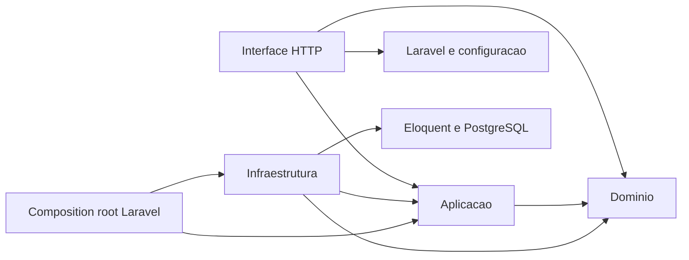
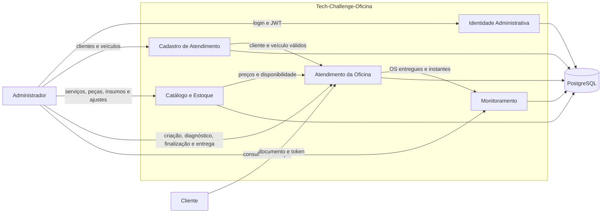
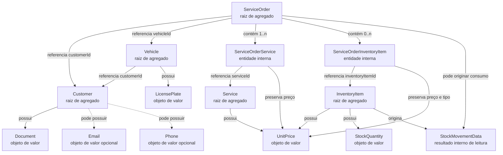
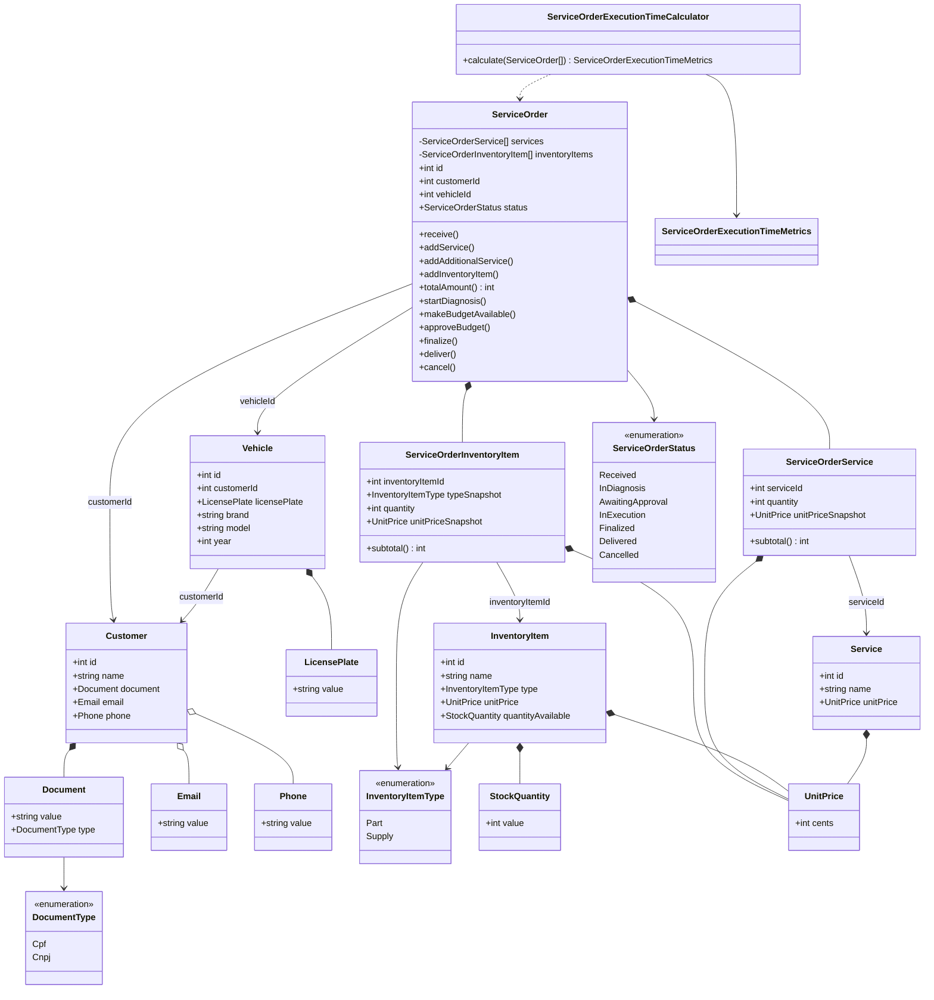
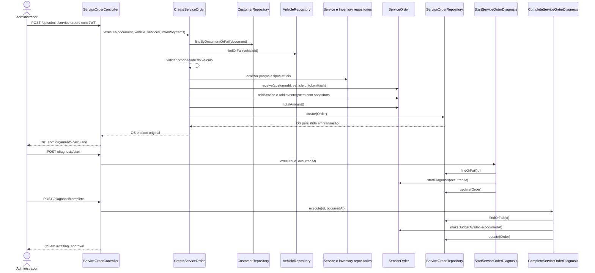
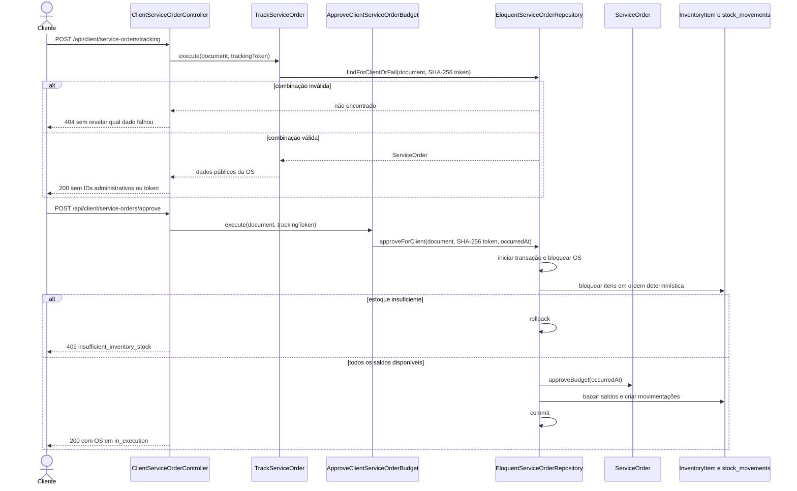
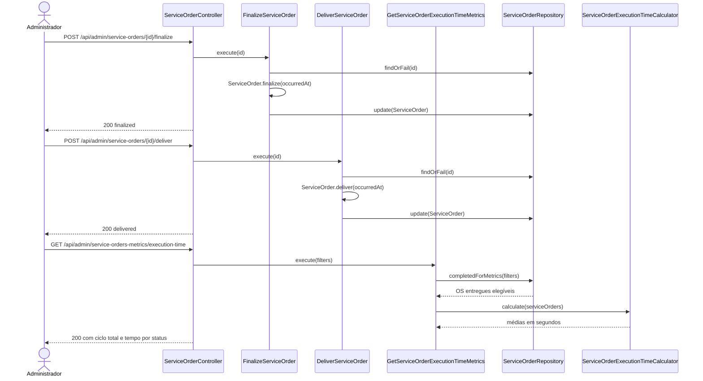
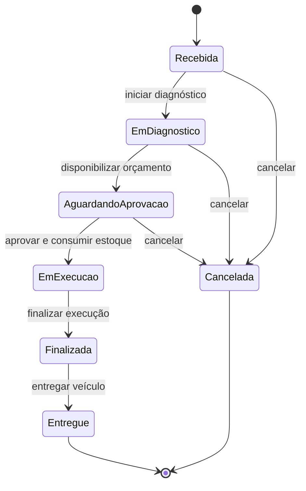

# Diagramas DDD

## Escopo

Os diagramas representam o monólito implementado e usam os identificadores reais do código. As divisões abaixo são limites conceituais internos, não microserviços. Os eventos, políticas, atores, read models, hotspots e fluxos de erro estão detalhados no [Event Storming](event-storming.md).

## Componentes e dependencias apos o Dia 4

As setas representam as dependencias conformes encontradas no codigo. Os Dias 3 e 4 removeram configuracao Laravel, modelos Eloquent e paginadores das fronteiras internas. A Interface HTTP recebe somente entidades, DTOs e resultados da Aplicacao; a Infraestrutura concentra os modelos Eloquent, inclusive o usuario administrativo.

O Dominio nao possui dependencia proibida. A composicao do Laravel e o ponto autorizado a conhecer ports e adapters concretos. Testes em `tests/Architecture` protegem automaticamente a direcao das dependencias, a ausencia de helpers Laravel nas camadas internas, a localizacao do Eloquent e a proibicao de `mixed` em Dominio e Aplicacao.

## Contexto Estratégico

| Contexto conceitual | Responsabilidade | Principais identificadores |
| --- | --- | --- |
| Identidade Administrativa | Autenticar o Administrador e emitir ou renovar JWT. | `LoginAdmin`, `RefreshAdminToken`, `AdminTokenProvider` |
| Cadastro de Atendimento | Manter Clientes e Veículos e proteger sua relação de propriedade. | `Customer`, `Document`, `Email`, `Phone`, `Vehicle`, `LicensePlate` |
| Catálogo e Estoque | Manter Serviços, Peças, Insumos, saldos e movimentações. | `Service`, `InventoryItem`, `StockQuantity`, `StockMovementData` |
| Atendimento da Oficina | Coordenar a OS, orçamento, acompanhamento, aprovação e ciclo operacional. | `ServiceOrder`, casos de uso em `Application/ServiceOrder` |
| Comunicacao de Status | Preparar mensagens minimas e tentar todos os contatos disponiveis sem acoplar o Dominio a fornecedores. | `DispatchServiceOrderStatusNotification`, ports em `Application/Notification` |
| Monitoramento | Calcular duração total e por estado das OS elegíveis. | `GetServiceOrderExecutionTimeMetrics`, `ServiceOrderExecutionTimeCalculator` |

O núcleo interno de notificações e os adapters de e-mail e SMS existem sem conexão às transições. O Compose fornece Mailpit local; SMTP de produção e Twilio permanecem configuráveis por ambiente. O SMS local usa adapter de log e nenhum segredo aparece no código. Ainda não há filas, pagamentos ou tempo real. A API REST lê o estado persistido e o PostgreSQL é o único banco da aplicação.

## Agregados e relações

### Limites de consistência

- `ServiceOrder` controla composição, total, status e instantes do ciclo de vida.
- `Customer`, `Vehicle`, `Service` e `InventoryItem` são persistidos separadamente e referenciados por identidade na OS.
- `ServiceOrderService` e `ServiceOrderInventoryItem` pertencem à composição histórica da OS e não substituem os itens dos catálogos.
- A aprovação exige consistência entre `ServiceOrder`, saldos de `InventoryItem` e movimentações. O repositório Eloquent impõe essa operação como uma única transação PostgreSQL com bloqueio de linhas.
- `StockMovementModel` é um registro de persistência imutável; não existe entidade de domínio independente para editar movimentações.

## Classes de Domínio

## Sequência: criação e disponibilização do orçamento

## Sequência: acompanhamento e aprovação com consumo de estoque

## Sequência: conclusão do ciclo e monitoramento

## Transições do agregado Ordem de Serviço

