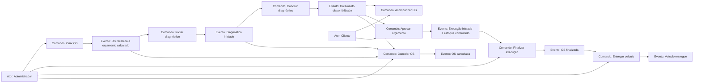
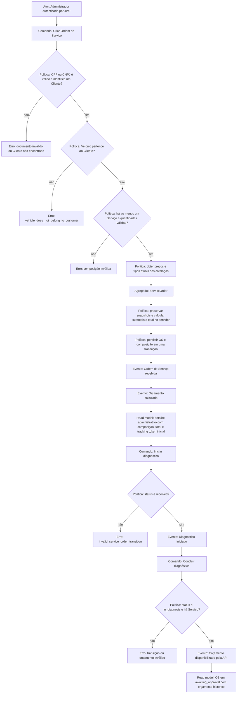
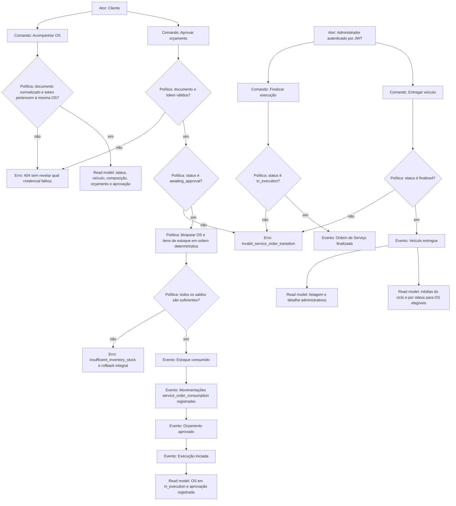
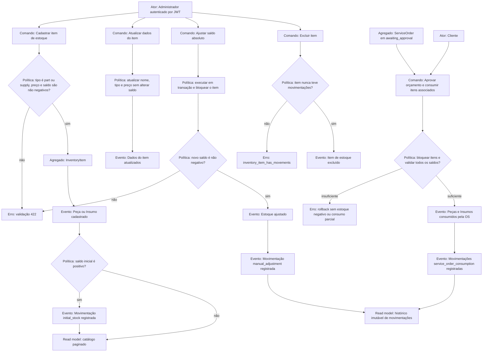

# Event Storming

## Escopo e legenda

Este documento modela os fluxos implementados de criação, acompanhamento e ciclo de vida da Ordem de Serviço, além da gestão de Peças, Insumos e Estoque. Os eventos abaixo descrevem fatos relevantes do domínio para fins de análise. A aplicação não publica eventos, não possui event bus e executa os casos de uso de forma síncrona no monólito Laravel.

| Elemento | Significado neste documento |
| --- | --- |
| Ator | Pessoa que inicia um comando pela API. |
| Comando | Intenção explícita executada por um endpoint ou caso de uso. |
| Evento | Fato de domínio que resulta de um comando bem-sucedido. |
| Política | Regra que decide ou condiciona a próxima ação. |
| Agregado | Limite responsável por preservar as invariantes da operação. |
| Read model | Visão de leitura devolvida pela API a partir do PostgreSQL. |
| Hotspot | Limite, risco ou decisão relevante do modelo atual. |

## Visão geral da Ordem de Serviço

## Criação e disponibilização do orçamento

### Fluxo principal

### Regras e políticas

- O cliente é localizado pelo CPF ou CNPJ normalizado e validado por dígitos verificadores.
- O veículo já deve existir e pertencer ao cliente informado; o fluxo atual não cadastra veículo dentro da criação da OS.
- A composição exige ao menos um Serviço. Peças e Insumos são opcionais e todas as quantidades informadas devem ser inteiras positivas.
- O servidor lê os valores atuais dos catálogos, grava snapshots de preço e tipo e calcula os subtotais e o total geral em centavos inteiros.
- A criação persiste a OS com `received`, gera um token aleatório específico e armazena somente seu hash SHA-256. O texto original do token aparece apenas na resposta imediata da criação.
- A criação não reduz estoque. O orçamento é disponibilizado exclusivamente pela API quando o diagnóstico é concluído.
- Reparos adicionais podem incluir Serviços somente enquanto a OS está em `awaiting_approval`; os preços atuais são capturados como novos snapshots e o total é recalculado.

### Eventos e correspondência com o código

| Evento de negócio | Estado ou dado persistido | Comando ou caso de uso |
| --- | --- | --- |
| Ordem de Serviço recebida | `status = received`, `received_at` | `CreateServiceOrder` |
| Orçamento calculado | composição, snapshots e `total_amount` | `CreateServiceOrder` |
| Diagnóstico iniciado | `status = in_diagnosis`, `diagnosis_started_at` | `StartServiceOrderDiagnosis` |
| Orçamento disponibilizado | `status = awaiting_approval`, `awaiting_approval_at` | `CompleteServiceOrderDiagnosis` |
| Reparos adicionais incluídos | novos Serviços e total recalculado | `AddAdditionalRepairs` |
| Ordem de Serviço cancelada | `status = cancelled`, `cancelled_at` | `CancelServiceOrder` |

## Acompanhamento, aprovação e ciclo operacional

### Segurança, consistência e erros

- O acompanhamento e a aprovação não usam JWT administrativo. Ambos exigem o documento normalizado do cliente e o token específico da OS.
- Uma combinação inválida retorna `404`, evitando confirmar se o documento, o token ou a OS existe.
- O read model do cliente não expõe IDs administrativos, documento completo nem token.
- A aprovação bloqueia a OS e os itens de estoque dentro de uma única transação PostgreSQL. Todos os saldos são validados antes da primeira baixa.
- Cada movimentação de consumo é única por OS e item. A transição para `in_execution` e a restrição de unicidade impedem repetição da baixa.
- Estoque insuficiente desfaz saldos, movimentações e mudança de status, retornando conflito.
- Finalização e entrega são comandos administrativos explícitos. Não existe edição genérica de status.
- A consulta de métricas inclui somente OS entregues com todos os instantes do fluxo principal e pode filtrar por período de entrega e Serviço.

## Gestão de Peças, Insumos e Estoque

### Relação entre estoque, orçamento e execução

- Peças e Insumos pertencem ao catálogo único `InventoryItem` e são distinguidos por `part` e `supply`.
- A inclusão na OS preserva preço, tipo e quantidade como composição histórica, mas não reserva nem reduz o saldo.
- O orçamento usa o snapshot em centavos, portanto uma atualização posterior no catálogo não altera o valor apresentado.
- O consumo acontece somente na aprovação que inicia a execução. Não há consumo no cadastro, na criação da OS ou na conclusão do diagnóstico.
- O histórico contém `initial_stock`, `manual_adjustment` e `service_order_consumption`; não existe comando para editar ou excluir movimentações.

## Agregados, políticas e read models

| Fluxo | Agregado ou limite de consistência | Políticas principais | Read models |
| --- | --- | --- | --- |
| Criação da OS | `ServiceOrder` e sua composição | propriedade do veículo, quantidades positivas, snapshots e total do servidor | resposta de criação e detalhe administrativo |
| Diagnóstico e orçamento | `ServiceOrder` | transição sequencial e existência de Serviço | detalhe administrativo e acompanhamento do cliente |
| Acompanhamento | consulta da `ServiceOrder` | documento e hash do token devem identificar a mesma OS | `ClientServiceOrderResource` |
| Aprovação | `ServiceOrder`, `InventoryItem` e movimentações em uma transação | estado válido, bloqueio, disponibilidade integral e consumo único | acompanhamento do cliente e histórico de estoque |
| Ciclo final | `ServiceOrder` | `in_execution` para `finalized` e `finalized` para `delivered` | listagem e detalhe administrativos |
| Estoque administrativo | `InventoryItem` e movimentações | saldo não negativo, ajuste explícito e histórico imutável | catálogo e histórico paginados |
| Monitoramento | conjunto de OS entregues elegíveis | instantes completos e filtros confirmados | média total e média por status |

## Sistemas externos

Os provedores de e-mail e SMS são sistemas externos opcionais acionados após a persistência das transições. O PostgreSQL é infraestrutura interna de persistência. Não há integração com WhatsApp, pagamentos, fornecedores, filas, WebSocket ou SSE. A API REST reflete imediatamente o estado persistido, mesmo quando um provedor de notificação falha.

## Hotspots e limites do MVP

| Hotspot | Tratamento atual |
| --- | --- |
| Evento de domínio versus implementação | Os eventos são fatos de modelagem; não há classes de evento, mensageria ou processamento assíncrono. |
| Notificação de status | Após cada transição persistida, o dispatcher tenta e-mail e SMS conforme os contatos disponíveis; falhas são isoladas e registradas sem reverter a OS. |
| Disponibilização do orçamento | O orçamento fica disponível pela API e a transição para `awaiting_approval` tenta notificar os contatos disponíveis. |
| Recusa do orçamento | A recusa usa o cancelamento administrativo nos estados anteriores à execução; não existe comando público de recusa nem status adicional. |
| Reparos adicionais | Somente Serviços podem ser acrescentados em `awaiting_approval`; não há versionamento formal do orçamento. |
| Disponibilidade antes da aprovação | A composição não reserva estoque; a disponibilidade definitiva é verificada transacionalmente na aprovação. |
| Acompanhamento em tempo real | Não há canal push; cada consulta REST lê o estado persistido mais recente. |
| Cadastro de veículo durante a OS | O endpoint de criação exige um Veículo previamente cadastrado e pertencente ao Cliente. |
| Autorização do cliente | Documento e token protegem consulta e aprovação; não existe conta ou sessão de cliente. |
| Edição de movimentações e status | Não existem operações genéricas; mudanças ocorrem somente por comandos explícitos. |

Esses pontos documentam limites confirmados e não representam funcionalidades pendentes para o MVP atual.
